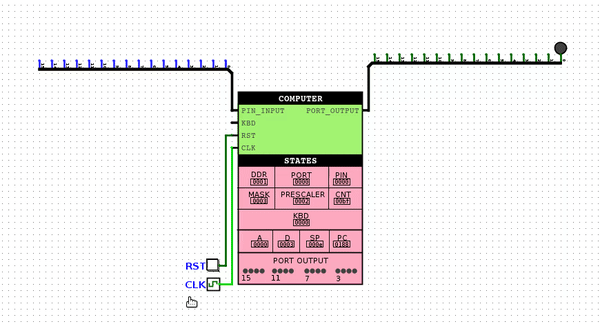
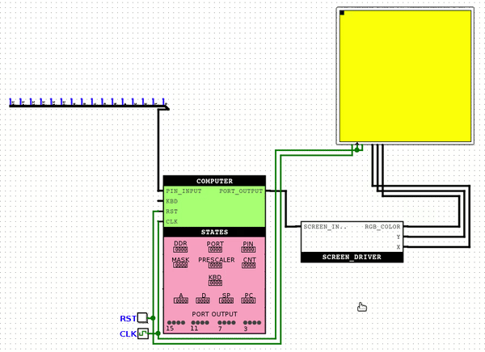
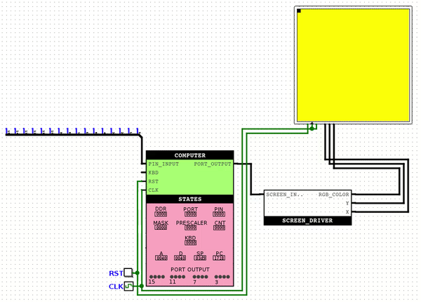

# fluffy-computer
Logisim-ში აწყობილი 16-ბიტიანი კომპიუტერი, რომლის არქიტექტურა წააგავს Hack კომპიუტერს. შეუძლია სპეციალურ ასემბლიში დაწერილი პროგრამების გაშვება. ჩაშენებული აქვს ტაიმერი და I/O პორტები, აქვს კლავიატურის შესაერთებელი.

## სარჩევი

* [გამოყენების ინსტრუქცია](#გამოყენების-ინსტრუქცია)
* [დეტალური აღწერა](#დეტალური-აღწერა)
  + [ასემბლის ინსტრუქციები](#ასემბლის-ინსტრუქციები)
    - [A ინსტრუქცია](#a-ინსტრუქცია)
    - [C ინსტრუქცია](#c-ინსტრუქცია)
    - [C ინსტრუქციისთვის საჭირო ცხრილები](#c-ინსტრუქციისთვის-საჭირო-ცხრილები)
  + [მეხსიერება](#მეხსიერება)
  + [წყვეტა](#წყვეტა)
  + [ასემბლერი](#ასემბლერი)
* [სამაგალითო პროგრამები](#სამაგალითო-პროგრამები)
  + [blinking_led](#blinking_led)
  + [rgb_led_controller](#rgb_led_controller)
  + [screen_and_keyboard](#screen_and_keyboard)
  + [paint_screen_white](#paint_screen_white)
  + [display_picture](#display_picture)

## გამოყენების ინსტრუქცია
თუ გვსურს საჩვენებელი პროგრამების გაშვება, უნდა გავხსნათ Logisim და ავირჩიოთ სასურველი წრედი examples ფოლდერიდან.

თუ გვსურს საკუთარი პროგრამის დაწერა, შევქმნით .asm ფაილს და assembler ფოლდერში არსებული Assembler.py-ით გადავიყვანთ ბინარულ ფაილში. ამ პროგრამის გასაშვებად, პირველ რიგში უნდა გავხსნათ luka ფოლდერიდან comp-ის ბოლო ვერსია. შემდეგ, შევიდეთ COMPUTER წრედში, მაუსის მარჯვენა ღილაკით დავაკლიკოთ ROM-ს და ავირჩიოთ "Load Image...", შემდეგ კი ავირჩიოთ ჩვენი შექმნილი .bin ფაილი. ამით წრედი უკვე მზად იქნება სიმულაციისთვის. 

დამატებითი ინფორმაციისთვის წაიკითხეთ დეტალური აღწერა.

## დეტალური აღწერა
### ასემბლის ინსტრუქციები
#### A ინსტრუქცია
`@[რიცხვი] – 0 [a0 a1 a2 a3 a4 a5 a6 a7 a8 a9 a10 a11 a12 a13 a14]`

a0 ... a14 არის 15 ბიტიანი მისამართი, რომელსაც მეხსიერებაში ავირჩევთ და შემდეგ ბრძანებებზე შევძლებთ M-ის დაწერით მივწვდეთ ამ ადგილას ჩაწერილ ინფორმაციას. მაგალითად,
```
@3
```
აირჩევს მე-3 ადგილს მეხსიერებაში. ამის შემდეგ თუ დავწერთ,
```
D = M
```
მაშინ მეხსიერების მე-3 რეგისტრში ჩაწერილი ინფორმაცია ჩაიწერება D რეგისტრში.

არსებობს A ინსტრუქციის მეორენაირი გამოყენებაც. როდესაც კომპიუტერს მივცემთ გადახტომის ინსტრუქციას, შემდეგი ბრძანება გაეშვება ROM-ის იმ ინდექსის მქონე რეგისტრიდან, რაც A რეგისტრში წერია. მაგალითად, განვილიხილოთ Unconditional Jump-ის შემთხვევა:
```
@5
0 ; JMP
```
ამის ეფექტი ის იქნება, რომ შემდეგი ინსტრუქცია გაეშვება ROM-ის მე-5 რეგისტრიდან.

A ინსტრუქციის ორობით ჩანაწერში პირველი ბიტი აუცილებლად ნულია, დანარჩენი კი სასურველი რიცხვის ორობით ჩანაწერს განსაზღვრავს. იმის გამო, რომ 16 ბიტიანი ინსტრუქციიდან 1 დაკავებულია, ერთი ინსტრუქციით შეგვიძლია ავირჩიოთ მაქსიმუმ (2<sup>15</sup> – 1).
#### C ინსტრუქცია
`destination = compute ; jump_condition – 1 [s] [p] [a0 a1 a2] [m] [o0 o1 o2] [d0 d1 d2] [j0 j1 j2]`

ამ ტიპის ინსტრუქცია ბევრად უფრო კომპლექსურია. ტოლობის მარჯვენა მხარეს ვწერთ იმ ოპერაციას, რაც გვინდა რომ ALU-მ გამოთვალოს. ტოლობის მარცხენა მხარეს ვწერთ იმ რეგისტრებს, რომლებშიც გვინდა რომ ეს შედეგი ჩაიწეროს. წერტილ-მძიმის შემდეგ დაწერილი პირობით ALU-ს შედეგი დარდება 0-ს და თუ ეს პირობა სრულდება, ROM-ი ხტება A რეგისტრში ჩაწერილ მნიშვნელობაზე. განვიხილოთ მაგალითი:
```
AMDS = D + A ; JGT
```
D რეგისტრში მყოფ მნიშვნელობას დაემატება A რეგისტრში მყოფი მნიშვნელობა. ამის შემდეგ, მიღებული შედეგი (ამ შემთხვევაში D + A) დარდება 0-ს და თუ ეს შედარება ჭეშმარიტია, მაშინ ხტება იმ ინსტრუქციაზე, რომლის ინდექსიც A რეგისტრში წერია. ამის შემდეგ M, D და A რეგისტრებში (M-ში იგულისხმება Memory-ში იმ რეგისტრის მნიშვნელობა, რომლის ინდექსიც ემთხვევა A რეგისტრში მყოფ მნიშვნელობას) იწერება ახალი მნიშვნელობები. ჩვენს შემთხვევაში გადახტომა შესრულდებოდა მაშინ, თუ JGT (**J**UMP IF **G**REATER **T**HAN) პირობა იქნებოდა ჭეშმარიტი, ანუ (D + A) მეტი იქნებოდა ნულზე. ასეთი ტიპის ინსტრუქციაში გასათვალისწინებელია, რომ ჯერ A რეგისტრის მნიშვნელობაზე გადადის ROM-ი და შემდეგ ხდება A-სთვის მნიშვნელობის მინიჭება.

C ინსტრუქციის გამოყენების სხვა მაგალითებია:
```
A = A + 1 // A რეგისტრის მნიშვნელობა გაიზარდოს 1-ით
M = M * D // Memory[A] = Memory[A] * D
DM = -1 // D და Memory[A] რეგისტრებში იწერება -1
ASD = D ^ A // A-სა და D-ში იწერება D xor A, აგრეთვე ემატება სტეკში
D = S + 1 // სტეკიდან ვიღებთ მნიშვნელობას, ემატება 1 და იწერება D-ში
S // სტეკიდან ვიღებთ მნიშვნელობას
!D ; JEQ // ვითვლით (not D) მნიშვნელობას და თუ 0-ია, ვხტებით
0 ; JMP // უპირობოდ ვხტებით A-ში მყოფ მნიშვნელობაზე
```
და ა.შ.

თუ გვსურს ამ ბრძანებების ორობითში გადაყვანა, თან უნდა გვქონდეს ასემბლერი ან C ინსტრუქციისთვის საჭირო ცხრილები და ვიცოდეთ რომელი ბიტი რას აღნიშნავს.

`1 [s] [p] [a0 a1 a2] [m] [o0 o1 o2] [d0 d1 d2] [j0 j1 j2]`

| ბიტი | დანიშნულება |
| :---: | --- |
1 | C ინსტრუქციის პირველი ბიტი აუცილებლად 1-ია.
s | განსაზღვრავს სრულდება თუ არა სტეკზე ოპერაცია.
p | თუ სტეკ ოპერაციაა, ეს ბიტი განსაზღვრავს push (0) გვინდა თუ pop (1).
a0 a1 a2 | ეს სამი ბიტი განსაზღვრავს თუ რა ოპერატორს ვიყენებთ.
m | თუ სტეკ ოპერაცია არ სრულდება, განსაზღვრავს გამოთვლის დროს A-ზე ხდება მოქმედება (0) თუ M-ზე (1).
o0 o1 o2 | განსაზღვრავს თუ რა პოზიცია უკავიათ ოპერანდებს. ერთი მხარე შეიძლება ეკავოს D-ს, ხოლო მეორეში არჩევანი უნდა გაკეთდეს A/M/S-ს შორის m, s და p ბიტების დახმარებით.
d0 d1 d2 | ეს ბიტები განსაზღვრავს თუ სად იწერება ALU-ს მიერ გამოთვლილი შედეგი. d0 არის A-სთვის, d1 არის M-სთვის, ხოლო d2 არის D-სთვის. (თუ ამავდროულად სტეკში გვინდა ჩაწერა, (s=1 & p=0) პირობა უნდა შესრულდეს.
j0 j1 j2 | ALU-ს გამოთვლილ შედეგს ადარებს 0-ს. შედარების ოპერატორი განსაზღვრულია ამ სამი ბიტით. j0 აღნიშნავს ნაკლებობას, j1 არის ტოლობა, ხოლო j2 არის მეტობა. ამ სამი ბიტის ვარიაციებით შეიძლება სხვა შედარების ოპერატორების მიღებაც.

C ინსტრუქციის გრამატიკა შემდეგნაირია:
```
C_INSTRUCTION = {DESTINATION = COMPUTE ; JUMP_CONDITION} ან {COMPUTE ; JUMP_CONDITION} ან {COMPUTE}
DESTINATION = {ყველა შესაძლო მნიშვნელობა დანიშნულების ადგილების ცხრილის destination სვეტიდან + შესაძლოა S იყოს ჩასმული ნებისმიერ ადგილას}
JUMP_CONDITION = {ყველა შესაძლო მნიშვნელობა შედარების ოპერატორების ცხრილის mnemonic სვეტიდან}
COMPUTE = {ყველა შესაძლო მნიშვნელობა ოპერანდების ცხრილის operand სვეტებიდან, სადაც * იქნება ჩანაცვლებული ოპერატორების ცხრილის operator სვეტიდან ნებისმიერი მნიშვნელობით}
```
#### C ინსტრუქციისთვის საჭირო ცხრილები
ოპერატორების ცხრილი:
|a0|a1|a2|operator|
|:---:|:---:|:---:|:---:|
0|0|0|+
0|0|1|-
0|1|0|*
0|1|1|/
1|0|0|!
1|0|1|&
1|1|0|\|
1|1|1|^

ოპერანდების ცხრილი (* აღნიშნავს ნებისმიერ ვალიდურ ოპერატორს)
|o0|o1|o2|operand (m=0 & p=0)|operand (m=1 & p=0)|operand (s=1 & p=1)
|:---:|:---:|:---:|:---:|:---:|:---:|
0|0|0|* 0|–|–
0|0|1|D * A|D * M|D * S
0|1|0|* A | * M| * S
0|1|1|* D|–|–
1|0|0|A * D|M * D|S * D
1|0|1|* 1|-|-
1|1|0|A * 1|M * 1|S * 1
1|1|1|D * 1|–|–

დანიშნულების ადგილების ცხრილი:
|d0 (A)|d1 (M)|d2 (D)|destination|
|:---:|:---:|:---:|:---:|
0|0|0|null
0|0|1|D
0|1|0|M
0|1|1|MD
1|0|0|A
1|0|1|AD
1|1|0|AM
1|1|1|AMD

შედარების ოპერატორების ცხრილი:
|j0 (out < 0)|j1 (out = 0)|j2 (out > 0)|mnemonic|effect|
|:---:|:---:|:---:|:---:|:---:|
0|0|0|null|no jump
0|0|1|JGT|If out > 0 jump
0|1|0|JEQ|If out = 0 jump
0|1|1|JGE|If out ≥ 0 jump
1|0|0|JLT|If out < 0 jump
1|0|1|JNE|If out ≠ 0 jump
1|1|0|JLE|If out ≤ 0 jump
1|1|1|JMP|jump

### მეხსიერება
მეხსიერების ჩიპი არის რამდენიმე მეხსიერების ერთეულის ერთობა. Stack და Heap ფიზიკურადაა გაყოფილი და მათი გადაფარვა არასდროს მოხდება. ასევე, არის სპეციალური რეგისტრები, რომლებსაც სათითაოდ განვიხილავთ ინდექსის მიხედვით. თუ იმ მისამართზე ვეცდებით ჩაწერას, რასაც Read Only წვდომა აქვს, იქ ჩაწერის ბრძანებას ეფექტი არ ექნება.

ინდექსი|დასახელება|წვდომა|დანიშნულება
|:---:|:---:|:---:|---|
0|DDR|Read/Write|მონაცემების მიმართულების რეგისტრი. სადაც 1 წერია, აღნიშნავს რომ ის ბიტი PORT-ზე არის გამოსასვლელი. სადაც 0 წერია, აღნიშნავს რომ ის ბიტი PIN-ზე არის შესასვლელი.
1|PORT|Read/Write|პორტ რეგისტრი. სადაც DDR-ში 1 წერია, შესაბამისი ბიტებიდან პორტის მნიშვნელობა კომპიუტერის გამოსასვლელზე აისახება.
2|PIN|Read Only|პინ რეგისტრი. სადაც DDR-ში 0 წერია, შესაბამისი ბიტებიდან კომპიუტერის შესასვლელის მნიშვნელობა პინზე აისახება.
3|MASK|Read/Write|მასკ რეგისტრი აკონტროლებს ტაიმერს. თუ მასკის ყველაზე მარჯვენა ბიტზე 1 წერია, ნიშნავს რომ Overflow Interrupt დაშვებულია. მარჯვნიდან მეორე ბიტი კი აკონტროლებს ჩართულია თუ არა ტაიმერი.
4|PRESCALER|Read/Write|პრესკალერ რეგისტრს იყენებს ტაიმერი. რა მნიშვნელობაც წერია მასში, ტაიმერი იმდენი ტაქტის შემდეგ ზრდის მთვლელს.
5|COUNTER|Read/Write|ქაუნთერ რეგისტრში იწერება ტაიმერის მთვლელის მნიშვნელობა. როცა ის 255-ს მიაღწევს, განულდება და შესრულდება წყვეტა თუ ეს დაშვებულია.  
6|KEYBOARD|Read Only|კლავიატურის რეგისტრი პირდაპირაა დაკავშირებული კომპიუტერის შესასვლელთან. მასში შესაძლებელია ნებისმიერი ASCII მნიშვნელობის ჩაწერა გარედან და შემდეგ კოდიდან წაკითხვა. 
7-22|R0-R15|Read/Write|16 დამხმარე რეგისტრი, რომლებსაც შეგვიძლია სახელით მივმართოთ და პროგრამის საჭიროებების მიხედვით გამოვიყენოთ.
23+|–|Read/Write|თუ ასემბლიში შევქმნით ცვლადს, ყოველი ახალი შექმნილი ცვლადის მისამართი მეხსიერებაში იქნება (23 + მერამდენეცაა_ეს_ცვლადი)
7-32774|–|Read/Write|Random Access Memory. გამოიყენება პროგრამის კონკრეტული საჭიროებებიდან გამომდინარე. ვერ მივმართავთ სახელით.

ასემბლიში მეხსიერების იმ ნაწილებს, რომლებსაც დასახელება აქვთ, ინდექსის გარდა, შეგვიძლია სახელით მივმართოთ. მაგალითად:
```
@MASK // იგივეა რაც @3
@KEYBOARD // იგივეა რაც @6
@R0 // იგივეა რაც @7
@R1 // იგივეა რაც @8
```

აგრეთვე, ასემბლიში შეგვიძლია საკუთარი დასახელების ცვლადების შექმნა. მაგალითად:
```
@x // x დასახელება პირველად შეხვდა, ამიტომ მეხსიერებაში გამოუყოფს 23-ე რეგისტრს
M = 1 // Memory[23]-ში ჩაიწერება 1
@y // y დასახელება პირველად შეხვდა, ამიტომ მეხსიერებაში გამოიყოფა 24-ე რეგისტრი ამ სახელით
D = A // D-ში ჩაიწერება 24
@x // იგივეა, რაც @23
M = M + 1 // Memory[23]-ში ჩაწერილი მნიშვნელობა გაიზრდება 1-ით
@y // იგივეა, რაც @24
```

საკუთარი დასახელებების შექმნა კიდევ ერთი გზითაა შესაძლებელი, რომელიც ინსტრუქციებზე გადახტომას გაგვიმარტივებს. განვიხილოთ მაგალითი:
```
(LOOP) // შეიქმნება დასახელება LOOP, რომელიც მიუთითებს მის მომდევნო ინსტრუქციის ინდექსზე ROM-ში
D = 1
@LOOP
0 ; JMP // ხტება (LOOP) ხაზის მომდევნო ხაზზე, რაც ჩვენს შემთხვევაში არის D = 1
```

ეს ფუნქციონალი იმპლემენტირებულია ასემბლერში და გამოსადეგია, მაგალითად, ციკლების იმპლემენტირებისას. აგრეთვე, თუ გვსურს წყვეტის ფუნქციის დაწერა, ასემბლერი ელის რომ წყვეტის ფუნქცია იწყება (INTERRUPT_FUNCTION) ხაზის შემდეგ.

### წყვეტა
თუ ტაიმერის მთვლელის მნიშვნელობა მიაღწევს 255-ს და დაშვებულია წყვეტა (MASK-ში ყველაზე მარჯვენა ბიტი არის 1), მაშინ კომპიუტერი წყვეტს მიმდინარე ინსტრუქციების შესრულებას და გადადის წყვეტის ფუნქციის შესრულებაზე. ამისთვის აუცილებელია ასემბლერის წინასწარ გაფრთხილება *-ih/--interrupt-header* არგუმენტით, რომელიც გამომავალ ორობით ფაილს თავში ამატებს მცირე ზომის კოდს, რომელიც განსაზღვრავს თუ რომელ ინსტრუქციაზე უნდა გადახტეს კომპიუტერი წყვეტის შემთხვევაში და რომელიც ასევე ინახავს A და D რეგისტრების მნიშვნელობებს სტეკში.

როცა ხდება წყვეტა, პირველ რიგში PC-ს მნიშვნელობა ემატება სტეკში და რესეტდება (ნულდება). შემდეგი ინსტრუქცია უკვე ROM[0]-დან ეშვება, სადაც ასემბლერის მიერ ჩამატებული Interrupt Header-ის კოდი წერია. ეს კოდი სტეკში ამატებს ჯერ A-ს, შემდეგ კი D-ს. ამის შემდეგ გადახტება წყვეტის ფუნქციაზე, რომლის დასაწყისიც (INTERRUPT_FUNCTION) ხაზით არის მონიშნული დეველოპერის მიერ. წყვეტის ფუნქციის ბოლოს A, D და PC რეგისტრების მნიშვნელობების აღდგენა დეველოპერის პასუხისმგებლობაა. თუ გსურთ, რომ წყვეტის ფუნქციის შესრულების შემდეგ ყველა ჩამოთვლილი რეგისტრის მნიშვნელობა აღდგეს, გთავაზობთ ერთ-ერთ შესაძლო კოდს, რომელიც ამას გააკეთებს:
```
(INTERRUPT_FUNCTION)
//
// აქ უნდა ეწეროს თქვენი წყვეტის ფუნქციის კოდი
//
D = S
@OLD_A
M = S
@OLD_PC
M = S
@OLD_A
S = M
@OLD_PC
A = M
A = S ; JMP
```
### ასემბლერი
ასემბლერი არის პროგრამა, რომელსაც ასემბლიზე დაწერილი კოდი გადაყავს ორობით ფაილში. ასემბლერის ამჟამინდელი ვერსია არ იძლევა გარანტიას, რომ არასწორად დაწერილ სინტაქსზე გაგვაფრთხილებს, თუმცა, როგორც წესი, არასწორი სინტაქსით დაწერილი კოდი არ კომპილირდება ხოლმე. 

ასემბლერის არგუმენტების სრული სია:
```
usage: Assembler.py [-h] [-ih] [-nxh] [-b] file

Convert assembly (.asm) file to binary (.bin) file in order to load it in
fluffy computer's ROM and run it.

positional arguments:
  file                  name of input assembly file

optional arguments:
  -h, --help            show this help message and exit
  -ih, --interrupt_header
                        write interrupt vector code in output file. if this is
                        true, label with the name "INTERRUPT_FUNCTION" must
                        also be added by the user
  -nxh, --no-hex-header
                        do not add hex header in output file, which is
                        something like "hex v3.0 words plain"
  -b, --binary          write output in binary instead of hexadecimal
  ```

## სამაგალითო პროგრამები
პროექტში დევს მარტივი საჩვენებელი პროგრამები იმის საილუსტრაციოდ, თუ რისი გაკეთება შეუძლია fluffy computer-ს. ამჯერად რამდენიმე ერთეული საჩვენებელი პროგრამა არსებობს, რომლებიც არც ისე რთულია დასაწერად, მაგრამ ბევრად მრავლფეროვანი და კომპლექსური პროგრამების დაწერაცაა შესაძლებელი. ქვემოთ მოცემულია ამ პროგრამების ჩამონათვალი.

### blinking_led
პროგრამა მართავს მიერთებულ LED ნათურას, რომლის განსაზღვრულ ინტერვალში ჩართვა/გამორთვას წყვეტის ფუნქცია უზრუნველყოფს.



### rgb_led_controller
მომხმარებელი ღილაკზე დაჭერით (ან switch-ის გადართვით) აკონტროლებს RGB LED ნათურას. ეს იმპლემენტირებულია პროგრამაში, რომელიც მუდმივად ამოწმებს პორტის შესასვლელზე მნიშვნელობას და ასახავს ამას გამოსასვლელზე.


### screen_and_keyboard
კომპიუტერზე თუ შევაერთებთ კლავიატურას და TTY ეკრანს, მაშინ შესაძლებელია კლავიატურის ღილაკებზე დაჭერით ტექსტის ეკრანზე ასახვა. პროგრამა უბრალოდ მუდმივად ამოწმებს კლავიატურის რეგისტრს და ცვლილების აღმოჩენის შემთხვევაში ასახავს ეკრანზე.


### paint_screen_white
ეს პროგრამა მიერთებულ ეკრანს თეთრად ღებავს. პორტის გამოსასვლელზე გაგზავნილ ინსტრუქციას SCREEN_DRIVER ჩიპი შიფრავს.



### display_picture
ფოლდერში "display_picture_examples" არის რამდენიმე პროგრამა, რომელიც სკრიპტითაა გენერირებული და შეუძლია სასურველი 32x32 სურათის ეკრანზე გამოტანა. ეს ჰგავს paint_screen_white პროგრამას, მაგრამ ეკრანისთვის გადაცემული ინსტრუქციები ყოველ ჯერზე სხვადასხვაა. ერთ-ერთი სურათის დახატვის პროცესი ქვემოთაა მოცემული.


