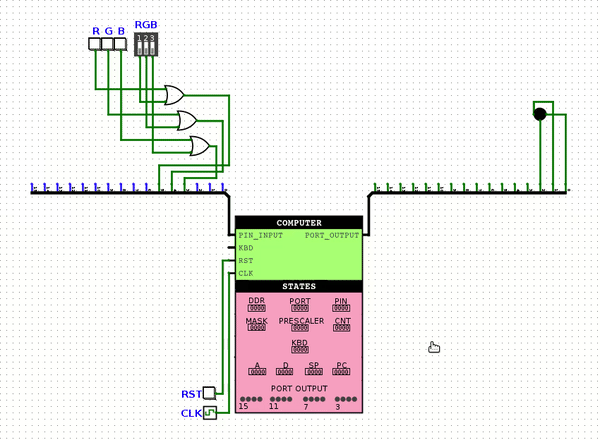

# fluffy-computer
A 16-bit computer implemented in Logisim, which follows the architecture of the Hack computer. It can execute programs written in a special assembly language. It includes a timer and I/O ports, as well as keyboard port and many more.

## Table of Contents

* [Usage Instructions](#Usage-Instructions)
* [Detailed Description](#Detailed-Description)
  + [Assembly Instructions](#Assembly-Instructions)
    - [A Instruction](#A-Instruction)
    - [C Instruction](#C-Instruction)
    - [Tables for C Instruction](#Tables-for-C-Instruction)
  + [Memory](#Memory)
  + [Interrupt](#Interrupt)
  + [Assembler](#Assembler)
* [Example Programs](#Example-Programs)
  + [blinking_led](#blinking_led)
  + [rgb_led_controller](#rgb_led_controller)
  + [screen_and_keyboard](#screen_and_keyboard)
  + [paint_screen_white](#paint_screen_white)
  + [display_picture](#display_picture)

## Usage Instructions
If you want to run the provided example programs, you need to open Logisim and select the desired circuit from the examples folder.

If you want to write your own program, create an .asm file and use the Assembler.py located in the assembler folder to convert it into a binary file. To execute this program, first open the latest comp version from the luka folder. Then, enter the COMPUTER module, click on the right button of the mouse on the ROM, select "Load Image...", and choose our created .bin file. The circuit is now ready for simulation.

For more detailed information, refer to the detailed description section.

## Detailed Description
### Assembly Instructions
#### A-instruction
@[number] – 0 [a0 a1 a2 a3 a4 a5 a6 a7 a8 a9 a10 a11 a12 a13 a14]

a0 ... a14 represents a 15-bit address that we select in memory, and then we can access the information written at this location by using the M instruction. For example,
```
@3
```
selects the memory location 3. If we then write,
```
D = M
```
the information stored at memory location 3 will be loaded into register D.

The A-instruction also has a secondary usage. When we give the computer a jump instruction, the next instruction is executed from the ROM index that is held in the A register. For example, let's consider the case of an Unconditional Jump:
```
@5
0 ; JMP
```
The effect of this is that the next instruction will be executed from the 5th register of ROM.

In the binary representation of the A-instruction, the first bit must be zero, and the remaining bits define the desired number in binary. Since the first bit is always zero, the remaining 15 bits define the desired number. Therefore, the range of representable numbers is from 0 to (2^15 – 1).

#### C Instruction
`destination = compute ; jump_condition – 1 [s] [p] [a0 a1 a2] [m] [o0 o1 o2] [d0 d1 d2] [j0 j1 j2]`

This type of instruction is much more complex. On the right side, we write the operation that we want the ALU to perform. On the left side, we write the registers where we want the result to be stored. After the semicolon, we write the condition for the ALU's output. If the condition evaluates to true, the ROM jumps to the value stored in register A. Let's consider an example:
```
AMDS = D + A ; JGT
```
The value stored in register D is added to the value stored in register A. After that, the resulting value (D + A in this case) is compared to 0, and if this comparison evaluates to true, the ROM jumps to the instruction whose index is stored in register A. After this, the values are written to registers M, D, and A (M register means the register which has the index equal to the value of A). In our case, the jump would have occurred if the JGT (**J**ump if **G**reater **T**han) condition were true, meaning (D + A) was greater than zero. It's important to note that in this type of instruction, the ROM first jumps to the value stored in register A, and then the assignment of the value to register A takes place.

These are the other examples for C instruction:
```
A = A + 1 // Increment the value of register A by 1
M = M * D // Memory[A] = Memory[A] * D
DM = -1 // Set the values of register D and Memory[A] to -1
ASD = D ^ A // Perform XOR operation between the D and A registers and store them in A, D and stack
D = S + 1 // Pop the value from stack, add 1 to that value and store the result in register D
S // Pop a value from the stack
!D ; JEQ // Negate the value in register D and jump if it is equal to 0
0 ; JMP // Unconditionally jump to the instruction located at the address specified by the value in register A
```
and so on.

If you want to convert these instructions into binary, you would need an assembler or a table that indicates the binary representation of each instruction and its corresponding bits.

`1 [s] [p] [a0 a1 a2] [m] [o0 o1 o2] [d0 d1 d2] [j0 j1 j2]`

| Bit | Meaning |
| :---: | --- |
1 | The first bit of the C instruction is always 1.
s | Indicates whether the operation is performed on the stack.
p | If it's a stack operation, this bit determines whether it's a push (0) or pop (1).
a0 a1 a2 | These three bits determine the specific operator used.
m | If it's not a stack operation, it specifies whether the operation is performed on A (0) or M (1) during the calculation.
o0 o1 o2 | Specifies which operands are involved in the operation. One side can be represented by D, while the another can take values among A/M/S based on the m, s, and p bits.
d0 d1 d2 | These bits specify where the ALU-computed result is stored. d0 corresponds to A, d1 to M, and d2 to D. (If we want to write to the stack (s=1 & p=0), the condition should be satisfied.)
j0 j1 j2 | Compares the ALU result with 0. The jump condition is determined by these three bits. j0 represents less than, j1 represents equal, and j2 represents greater. Various combinations of these three bits can be used to obtain different jump conditions.

The grammar of the C instruction is as follows:

```
C_INSTRUCTION = {DESTINATION = COMPUTE ; JUMP_CONDITION} or {COMPUTE ; JUMP_CONDITION} or {COMPUTE}
DESTINATION = {any possible value for the destination column in the destination table + S can be included anywhere}
JUMP_CONDITION = {any value from the mnemonic column in the comparison table}
COMPUTE = {any value from the operand column of the operands table, where * will be replaced by any value from the operator column of the operators table}
```

#### Tables for C Instruction
Operators Table:
|a0|a1|a2|operator|
|:---:|:---:|:---:|:---:|
0|0|0|+
0|0|1|-
0|1|0|*
0|1|1|/
1|0|0|!
1|0|1|&
1|1|0|\|
1|1|1|^

Operands Table (* indicates any valid operator)
|o0|o1|o2|operand (m=0 & p=0)|operand (m=1 & p=0)|operand (s=1 & p=1)
|:---:|:---:|:---:|:---:|:---:|:---:|
0|0|0|* 0|–|–
0|0|1|D * A|D * M|D * S
0|1|0|* A | * M| * S
0|1|1|* D|–|–
1|0|0|A * D|M * D|S * D
1|0|1|* 1|-|-
1|1|0|A * 1|M * 1|S * 1
1|1|1|D * 1|–|–

Destinations Table:
|d0 (A)|d1 (M)|d2 (D)|destination|
|:---:|:---:|:---:|:---:|
0|0|0|null
0|0|1|D
0|1|0|M
0|1|1|MD
1|0|0|A
1|0|1|AD
1|1|0|AM
1|1|1|AMD

Comparison Table:
|j0 (out < 0)|j1 (out = 0)|j2 (out > 0)|mnemonic|effect|
|:---:|:---:|:---:|:---:|:---:|
0|0|0|null|no jump
0|0|1|JGT|If out > 0 jump
0|1|0|JEQ|If out = 0 jump
0|1|1|JGE|If out ≥ 0 jump
1|0|0|JLT|If out < 0 jump
1|0|1|JNE|If out ≠ 0 jump
1|1|0|JLE|If out ≤ 0 jump
1|1|1|JMP|jump

### მეხსიერება
მეხსიერების ჩიპი არის რამდენიმე მეხსიერების ერთეულის ერთობა. Stack და Heap ფიზიკურადაა გაყოფილი და მათი გადაფარვა არასდროს მოხდება. ასევე, არის სპეციალური რეგისტრები, რომლებსაც სათითაოდ განვიხილავთ ინდექსის მიხედვით. თუ იმ მისამართზე ვეცდებით ჩაწერას, რასაც Read Only წვდომა აქვს, იქ ჩაწერის ბრძანებას ეფექტი არ ექნება.

ინდექსი|დასახელება|წვდომა|დანიშნულება
|:---:|:---:|:---:|---|
0|DDR|Read/Write|მონაცემების მიმართულების რეგისტრი. სადაც 1 წერია, აღნიშნავს რომ ის ბიტი PORT-ზე არის გამოსასვლელი. სადაც 0 წერია, აღნიშნავს რომ ის ბიტი PIN-ზე არის შესასვლელი.
1|PORT|Read/Write|პორტ რეგისტრი. სადაც DDR-ში 1 წერია, შესაბამისი ბიტებიდან პორტის მნიშვნელობა კომპიუტერის გამოსასვლელზე აისახება.
2|PIN|Read Only|პინ რეგისტრი. სადაც DDR-ში 0 წერია, შესაბამისი ბიტებიდან კომპიუტერის შესასვლელის მნიშვნელობა პინზე აისახება.
3|MASK|Read/Write|მასკ რეგისტრი აკონტროლებს ტაიმერს. თუ მასკის ყველაზე მარჯვენა ბიტზე 1 წერია, ნიშნავს რომ Overflow Interrupt დაშვებულია. მარჯვნიდან მეორე ბიტი კი აკონტროლებს ჩართულია თუ არა ტაიმერი.
4|PRESCALER|Read/Write|პრესკალერ რეგისტრს იყენებს ტაიმერი. რა მნიშვნელობაც წერია მასში, ტაიმერი იმდენი ტაქტის შემდეგ ზრდის მთვლელს.
5|COUNTER|Read/Write|ქაუნთერ რეგისტრში იწერება ტაიმერის მთვლელის მნიშვნელობა. როცა ის 255-ს მიაღწევს, განულდება და შესრულდება წყვეტა თუ ეს დაშვებულია.  
6|KEYBOARD|Read Only|კლავიატურის რეგისტრი პირდაპირაა დაკავშირებული კომპიუტერის შესასვლელთან. მასში შესაძლებელია ნებისმიერი ASCII მნიშვნელობის ჩაწერა გარედან და შემდეგ კოდიდან წაკითხვა. 
7-22|R0-R15|Read/Write|16 დამხმარე რეგისტრი, რომლებსაც შეგვიძლია სახელით მივმართოთ და პროგრამის საჭიროებების მიხედვით გამოვიყენოთ.
23+|–|Read/Write|თუ ასემბლიში შევქმნით ცვლადს, ყოველი ახალი შექმნილი ცვლადის მისამართი მეხსიერებაში იქნება (23 + მერამდენეცაა_ეს_ცვლადი)
7-32774|–|Read/Write|Random Access Memory. გამოიყენება პროგრამის კონკრეტული საჭიროებებიდან გამომდინარე. ვერ მივმართავთ სახელით.

ასემბლიში მეხსიერების იმ ნაწილებს, რომლებსაც დასახელება აქვთ, ინდექსის გარდა, შეგვიძლია სახელით მივმართოთ. მაგალითად:
```
@MASK // იგივეა რაც @3
@KEYBOARD // იგივეა რაც @6
@R0 // იგივეა რაც @7
@R1 // იგივეა რაც @8
```

აგრეთვე, ასემბლიში შეგვიძლია საკუთარი დასახელების ცვლადების შექმნა. მაგალითად:
```
@x // x დასახელება პირველად შეხვდა, ამიტომ მეხსიერებაში გამოუყოფს 23-ე რეგისტრს
M = 1 // Memory[23]-ში ჩაიწერება 1
@y // y დასახელება პირველად შეხვდა, ამიტომ მეხსიერებაში გამოიყოფა 24-ე რეგისტრი ამ სახელით
D = A // D-ში ჩაიწერება 24
@x // იგივეა, რაც @23
M = M + 1 // Memory[23]-ში ჩაწერილი მნიშვნელობა გაიზრდება 1-ით
@y // იგივეა, რაც @24
```

საკუთარი დასახელებების შექმნა კიდევ ერთი გზითაა შესაძლებელი, რომელიც ინსტრუქციებზე გადახტომას გაგვიმარტივებს. განვიხილოთ მაგალითი:
```
(LOOP) // შეიქმნება დასახელება LOOP, რომელიც მიუთითებს მის მომდევნო ინსტრუქციის ინდექსზე ROM-ში
D = 1
@LOOP
0 ; JMP // ხტება (LOOP) ხაზის მომდევნო ხაზზე, რაც ჩვენს შემთხვევაში არის D = 1
```

ეს ფუნქციონალი იმპლემენტირებულია ასემბლერში და გამოსადეგია, მაგალითად, ციკლების იმპლემენტირებისას. აგრეთვე, თუ გვსურს წყვეტის ფუნქციის დაწერა, ასემბლერი ელის რომ წყვეტის ფუნქცია იწყება (INTERRUPT_FUNCTION) ხაზის შემდეგ.

### წყვეტა
თუ ტაიმერის მთვლელის მნიშვნელობა მიაღწევს 255-ს და დაშვებულია წყვეტა (MASK-ში ყველაზე მარჯვენა ბიტი არის 1), მაშინ კომპიუტერი წყვეტს მიმდინარე ინსტრუქციების შესრულებას და გადადის წყვეტის ფუნქციის შესრულებაზე. ამისთვის აუცილებელია ასემბლერის წინასწარ გაფრთხილება *-ih/--interrupt-header* არგუმენტით, რომელიც გამომავალ ორობით ფაილს თავში ამატებს მცირე ზომის კოდს, რომელიც განსაზღვრავს თუ რომელ ინსტრუქციაზე უნდა გადახტეს კომპიუტერი წყვეტის შემთხვევაში და რომელიც ასევე ინახავს A და D რეგისტრების მნიშვნელობებს სტეკში.

როცა ხდება წყვეტა, პირველ რიგში PC-ს მნიშვნელობა ემატება სტეკში და რესეტდება (ნულდება). შემდეგი ინსტრუქცია უკვე ROM[0]-დან ეშვება, სადაც ასემბლერის მიერ ჩამატებული Interrupt Header-ის კოდი წერია. ეს კოდი სტეკში ამატებს ჯერ A-ს, შემდეგ კი D-ს. ამის შემდეგ გადახტება წყვეტის ფუნქციაზე, რომლის დასაწყისიც (INTERRUPT_FUNCTION) ხაზით არის მონიშნული დეველოპერის მიერ. წყვეტის ფუნქციის ბოლოს A, D და PC რეგისტრების მნიშვნელობების აღდგენა დეველოპერის პასუხისმგებლობაა. თუ გსურთ, რომ წყვეტის ფუნქციის შესრულების შემდეგ ყველა ჩამოთვლილი რეგისტრის მნიშვნელობა აღდგეს, გთავაზობთ ერთ-ერთ შესაძლო კოდს, რომელიც ამას გააკეთებს:
```
(INTERRUPT_FUNCTION)
//
// აქ უნდა ეწეროს თქვენი წყვეტის ფუნქციის კოდი
//
D = S
@OLD_A
M = S
@OLD_PC
M = S
@OLD_A
S = M
@OLD_PC
A = M
A = S ; JMP
```
### ასემბლერი
ასემბლერი არის პროგრამა, რომელსაც ასემბლიზე დაწერილი კოდი გადაყავს ორობით ფაილში. ასემბლერის ამჟამინდელი ვერსია არ იძლევა გარანტიას, რომ არასწორად დაწერილ სინტაქსზე გაგვაფრთხილებს, თუმცა, როგორც წესი, არასწორი სინტაქსით დაწერილი კოდი არ კომპილირდება ხოლმე. 

ასემბლერის არგუმენტების სრული სია:
```
usage: Assembler.py [-h] [-ih] [-nxh] [-b] file

Convert assembly (.asm) file to binary (.bin) file in order to load it in
fluffy computer's ROM and run it.

positional arguments:
  file                  name of input assembly file

optional arguments:
  -h, --help            show this help message and exit
  -ih, --interrupt_header
                        write interrupt vector code in output file. if this is
                        true, label with the name "INTERRUPT_FUNCTION" must
                        also be added by the user
  -nxh, --no-hex-header
                        do not add hex header in output file, which is
                        something like "hex v3.0 words plain"
  -b, --binary          write output in binary instead of hexadecimal
  ```

## სამაგალითო პროგრამები
პროექტში დევს მარტივი საჩვენებელი პროგრამები იმის საილუსტრაციოდ, თუ რისი გაკეთება შეუძლია fluffy computer-ს. ამჯერად რამდენიმე ერთეული საჩვენებელი პროგრამა არსებობს, რომლებიც არც ისე რთულია დასაწერად, მაგრამ ბევრად მრავლფეროვანი და კომპლექსური პროგრამების დაწერაცაა შესაძლებელი. ქვემოთ მოცემულია ამ პროგრამების ჩამონათვალი.

### blinking_led
პროგრამა მართავს მიერთებულ LED ნათურას, რომლის განსაზღვრულ ინტერვალში ჩართვა/გამორთვას წყვეტის ფუნქცია უზრუნველყოფს.


### rgb_led_controller
მომხმარებელი ღილაკზე დაჭერით (ან switch-ის გადართვით) აკონტროლებს RGB LED ნათურას. ეს იმპლემენტირებულია პროგრამაში, რომელიც მუდმივად ამოწმებს პორტის შესასვლელზე მნიშვნელობას და ასახავს ამას გამოსასვლელზე.



### screen_and_keyboard
კომპიუტერზე თუ შევაერთებთ კლავიატურას და TTY ეკრანს, მაშინ შესაძლებელია კლავიატურის ღილაკებზე დაჭერით ტექსტის ეკრანზე ასახვა. პროგრამა უბრალოდ მუდმივად ამოწმებს კლავიატურის რეგისტრს და ცვლილების აღმოჩენის შემთხვევაში ასახავს ეკრანზე.


### paint_screen_white
ეს პროგრამა მიერთებულ ეკრანს თეთრად ღებავს. პორტის გამოსასვლელზე გაგზავნილ ინსტრუქციას SCREEN_DRIVER ჩიპი შიფრავს.


### display_picture
ფოლდერში "display_picture_examples" არის რამდენიმე პროგრამა, რომელიც სკრიპტითაა გენერირებული და შეუძლია სასურველი 32x32 სურათის ეკრანზე გამოტანა. ეს ჰგავს paint_screen_white პროგრამას, მაგრამ ეკრანისთვის გადაცემული ინსტრუქციები ყოველ ჯერზე სხვადასხვაა. ერთ-ერთი სურათის დახატვის პროცესი ქვემოთაა მოცემული.


