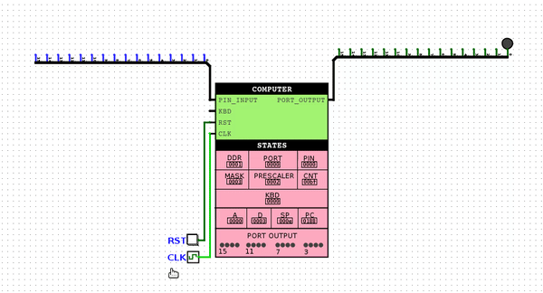
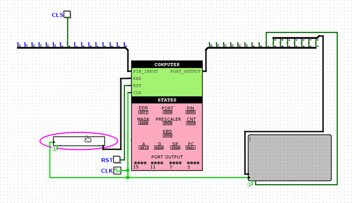
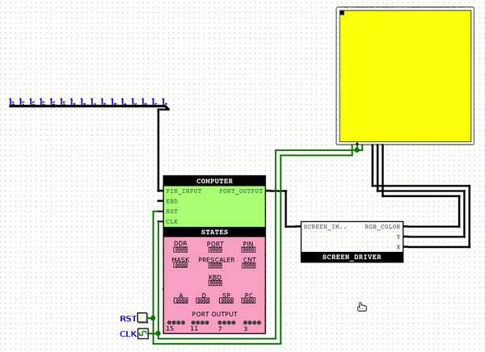

# fluffy-computer
A 16-bit computer implemented in Logisim, which follows the architecture of the Hack computer. It can execute programs written in a special assembly language. It includes a timer and I/O ports, as well as keyboard port and many more.

[](./README-ge.md) [GE](./README-ge.md) | [](./README.md) US

## Table of Contents

* [Usage Instructions](#Usage-Instructions)
* [Detailed Description](#Detailed-Description)
  + [Assembly Instructions](#Assembly-Instructions)
    - [A Instruction](#A-Instruction)
    - [C Instruction](#C-Instruction)
    - [Tables for C Instruction](#Tables-for-C-Instruction)
  + [Memory](#Memory)
  + [Interrupt](#Interrupt)
  + [Assembler](#Assembler)
* [Example Programs](#Example-Programs)
  + [blinking_led](#blinking_led)
  + [rgb_led_controller](#rgb_led_controller)
  + [screen_and_keyboard](#screen_and_keyboard)
  + [paint_screen_white](#paint_screen_white)
  + [display_picture](#display_picture)

## Usage Instructions
If you want to run the provided example programs, you need to open Logisim and select the desired circuit from the examples folder.

If you want to write your own program, create an .asm file and use the Assembler.py located in the assembler folder to convert it into a binary file. To execute this program, first open the latest comp version from the luka folder. Then, enter the COMPUTER module, click on the right button of the mouse on the ROM, select "Load Image...", and choose our created .bin file. The circuit is now ready for simulation.

For more detailed information, refer to the detailed description section.

## Detailed Description
### Assembly Instructions
#### A-instruction
`@[number] – 0 [a0 a1 a2 a3 a4 a5 a6 a7 a8 a9 a10 a11 a12 a13 a14]`

a0 ... a14 represents a 15-bit address that we select in memory, and then we can access the information written at this location by using the M instruction. For example,
```
@3
```
selects the memory location 3. If we then write,
```
D = M
```
the information stored at memory location 3 will be loaded into register D.

The A-instruction also has a secondary usage. When we give the computer a jump instruction, the next instruction is executed from the ROM index that is held in the A register. For example, let's consider the case of an Unconditional Jump:
```
@5
0 ; JMP
```
The effect of this is that the next instruction will be executed from the 5th register of ROM.

In the binary representation of the A-instruction, the first bit must be zero, and the remaining bits define the desired number in binary. Since the first bit is always zero, the remaining 15 bits define the desired number. Therefore, the range of representable numbers is from 0 to (2^15 – 1).

#### C Instruction
`destination = compute ; jump_condition – 1 [s] [p] [a0 a1 a2] [m] [o0 o1 o2] [d0 d1 d2] [j0 j1 j2]`

This type of instruction is much more complex. On the right side, we write the operation that we want the ALU to perform. On the left side, we write the registers where we want the result to be stored. After the semicolon, we write the condition for the ALU's output. If the condition evaluates to true, the ROM jumps to the value stored in register A. Let's consider an example:
```
AMDS = D + A ; JGT
```
The value stored in register D is added to the value stored in register A. After that, the resulting value (D + A in this case) is compared to 0, and if this comparison evaluates to true, the ROM jumps to the instruction whose index is stored in register A. After this, the values are written to registers M, D, and A (M register means the register which has the index equal to the value of A). In our case, the jump would have occurred if the JGT (**J**ump if **G**reater **T**han) condition were true, meaning (D + A) was greater than zero. It's important to note that in this type of instruction, the ROM first jumps to the value stored in register A, and then the assignment of the value to register A takes place.

These are the other examples for C instruction:
```
A = A + 1 // Increment the value of register A by 1
M = M * D // Memory[A] = Memory[A] * D
DM = -1 // Set the values of register D and Memory[A] to -1
ASD = D ^ A // Perform XOR operation between the D and A registers and store them in A, D and stack
D = S + 1 // Pop the value from stack, add 1 to that value and store the result in register D
S // Pop a value from the stack
!D ; JEQ // Negate the value in register D and jump if it is equal to 0
0 ; JMP // Unconditionally jump to the instruction located at the address specified by the value in register A
```
and so on.

If you want to convert these instructions into binary, you would need an assembler or a table that indicates the binary representation of each instruction and its corresponding bits.

`1 [s] [p] [a0 a1 a2] [m] [o0 o1 o2] [d0 d1 d2] [j0 j1 j2]`

| Bit | Meaning |
| :---: | --- |
1 | The first bit of the C instruction is always 1.
s | Indicates whether the operation is performed on the stack.
p | If it's a stack operation, this bit determines whether it's a push (0) or pop (1).
a0 a1 a2 | These three bits determine the specific operator used.
m | If it's not a stack operation, it specifies whether the operation is performed on A (0) or M (1) during the calculation.
o0 o1 o2 | Specifies which operands are involved in the operation. One side can be represented by D, while the another can take values among A/M/S based on the m, s, and p bits.
d0 d1 d2 | These bits specify where the ALU-computed result is stored. d0 corresponds to A, d1 to M, and d2 to D. (If we want to write to the stack (s=1 & p=0), the condition should be satisfied.)
j0 j1 j2 | Compares the ALU result with 0. The jump condition is determined by these three bits. j0 represents less than, j1 represents equal, and j2 represents greater. Various combinations of these three bits can be used to obtain different jump conditions.

The grammar of the C instruction is as follows:

```
C_INSTRUCTION = {DESTINATION = COMPUTE ; JUMP_CONDITION} or {COMPUTE ; JUMP_CONDITION} or {COMPUTE}
DESTINATION = {any possible value for the destination column in the destination table + S can be included anywhere}
JUMP_CONDITION = {any value from the mnemonic column in the comparison table}
COMPUTE = {any value from the operand column of the operands table, where * will be replaced by any value from the operator column of the operators table}
```

#### Tables for C Instruction
Operators Table:
|a0|a1|a2|operator|
|:---:|:---:|:---:|:---:|
0|0|0|+
0|0|1|-
0|1|0|*
0|1|1|/
1|0|0|!
1|0|1|&
1|1|0|\|
1|1|1|^

Operands Table (* indicates any valid operator)
|o0|o1|o2|operand (m=0 & p=0)|operand (m=1 & p=0)|operand (s=1 & p=1)
|:---:|:---:|:---:|:---:|:---:|:---:|
0|0|0|* 0|–|–
0|0|1|D * A|D * M|D * S
0|1|0|* A | * M| * S
0|1|1|* D|–|–
1|0|0|A * D|M * D|S * D
1|0|1|* 1|-|-
1|1|0|A * 1|M * 1|S * 1
1|1|1|D * 1|–|–

Destinations Table:
|d0 (A)|d1 (M)|d2 (D)|destination|
|:---:|:---:|:---:|:---:|
0|0|0|null
0|0|1|D
0|1|0|M
0|1|1|MD
1|0|0|A
1|0|1|AD
1|1|0|AM
1|1|1|AMD

Comparison Table:
|j0 (out < 0)|j1 (out = 0)|j2 (out > 0)|mnemonic|effect|
|:---:|:---:|:---:|:---:|:---:|
0|0|0|null|no jump
0|0|1|JGT|If out > 0 jump
0|1|0|JEQ|If out = 0 jump
0|1|1|JGE|If out ≥ 0 jump
1|0|0|JLT|If out < 0 jump
1|0|1|JNE|If out ≠ 0 jump
1|1|0|JLE|If out ≤ 0 jump
1|1|1|JMP|jump

### Memory
Memory chip consists of several memory units. Stack and Heap are separated physically and they will never overlap. There are also special registers that will be individually addressed below. When attempting to write to an address which has a Read Only access, the write operation will have no effect.

Index | Name | Access | Description
|:---:|:---:|:---:|---|
0 | DDR | Read/Write | Data Direction Register. When a bit is set to 1, it indicates that the corresponding bit is an output on the PORT. When a bit is set to 0, it indicates that the corresponding bit is an input on the PIN.
1 | PORT | Read/Write | Port Register. When the corresponding bit in DDR is set to 1, the value of the port is stored on the computer's output pins.
2 | PIN | Read Only | Pin Register. When the corresponding bit in DDR is set to 0, the value of the computer's input pins is stored on the pin.
3 | MASK | Read/Write | Mask Register controls the timer. If the rightmost bit of the mask is set to 1, it indicates that the Overflow Interrupt is enabled. The second bit from the right controls whether the timer is running or not.
4 | PRESCALER | Read/Write | Prescaler Register used by the timer. The value written to it determines how many clock ticks it takes for the timer to increment.
5 | COUNTER | Read/Write | Counter Register stores the value of the timer's counter. When it reaches 255, it resets and interrupt function is performed if it is enabled.
6 | KEYBOARD | Read Only | Keyboard Register directly connected to the computer's input. It allows writing any ASCII value from the keyboard and reading from the code.
7-22 | R0-R15 | Read/Write | 16 general-purpose registers that can be accessed by name and used according to program requirements.
23+ | – | Read/Write | If we create a variable in assembly, each newly created variable will be stored in memory at the address (23 + the number of variables created so far).
7-32774 | – | Read/Write | Random Access Memory. Used for the specific needs of the program. We cannot address it by name.

In assembly, we can refer to the parts of memory that have names, other than using the index, by using their names. For example:
```
@MASK // Same as @3
@KEYBOARD // Same as @6
@R0 // Same as @7
@R1 // Same as @8
```

Also, in assembly, we can create variables with custom names. For example:
```
@x // The name x is assigned to the first available memory, so it occupies register 23
M = 1 // Write 1 to Memory[23]
@y // The name y is assigned to the next available memory, so it occupies register 24
D = A // Store the value in A to D
@x // Same as @23
M = M + 1 // Increment the value stored in Memory[23] by 1
@y // Same as @24
```

There is another way to create custom names, which simplifies jumping to instructions. Let's consider an example:
```
(LOOP) // Create a label named LOOP that points to the next instruction's index in the ROM
D = 1
@LOOP
0 ; JMP // Jump to the instruction at the next line of LOOP label, which in our case is D = 1
```

This functionality is implemented in the assembler and can be used, for example, when implementing loops. Additionally, if we want to write an interrupt function, the assembler expects us to write the interrupt function instructions right after (INTERRUPT_FUNCTION) line.

### Interrupt
If the value of the timer counter reaches 255 and the overflow is enabled (the rightmost bit of MASK is 1), the computer interrupts the execution of the current instructions and jumps to the interrupt function. For this, it is necessary to give the assembler the *-ih/--interrupt-header* argument. This argument adds a small piece of code to the beginning of the generated output file, which specifies the instruction where the computer jumps in case of an interrupt. It also saves the values of registers A and D to the stack before the jump.

When an interrupt occurs, the value of PC is pushed onto the stack and reset to zero. The next instruction is fetched from ROM[0], where the code of the Interrupt Header added by the assembler is written. This code first pushes the value of A onto the stack and then pushes the value of D. After that, it jumps to the interrupt function, whose starting point (INTERRUPT_FUNCTION) is designated by the developer. At the end of the interrupt function, the restoration of the values of A, D, and PC registers is the responsibility of the developer. If you want all the previously saved register values to be restored after the execution of the interrupt function, we suggest using the following code:
```
(INTERRUPT_FUNCTION)
//
// Here you should write your interrupt function code
//
D = S
@OLD_A
M = S
@OLD_PC
M = S
@OLD_A
S = M
@OLD_PC
A = M
A = S ; JMP
```
### Assembler
Assembler is a program that translates code written in assembly language into binary files. The current version of the assembler does not guarantee correctness when dealing with improperly written syntax, although code with incorrect syntax generally does not compile.

Here is the complete list of assembler arguments:
```
usage: Assembler.py [-h] [-ih] [-nxh] [-b] file

Convert assembly (.asm) file to binary (.bin) file in order to load it in
fluffy computer's ROM and run it.

positional arguments:
  file                  name of input assembly file

optional arguments:
  -h, --help            show this help message and exit
  -ih, --interrupt_header
                        write interrupt vector code in output file. if this is
                        true, label with the name "INTERRUPT_FUNCTION" must
                        also be added by the user
  -nxh, --no-hex-header
                        do not add hex header in output file, which is
                        something like "hex v3.0 words plain"
  -b, --binary          write output in binary instead of hexadecimal
  ```

## Example Programs
The project includes several simple demonstrative programs showcasing what can be achieved with the Fluffy computer. Currently, there are a few basic programs available, which demonstrate various functionalities but much more complex programs can be written. Below is an overview of example programs.

### blinking_led
This program controls an attached LED by turning it on and off at a specified interval using the interrupt function.



### rgb_led_controller
By pressing a button (or toggling a switch), the user can control an RGB LED. This functionality is implemented in a program that constantly checks the input port's value and displays it on the output port.


### screen_and_keyboard
When a keyboard and TTY screen are connected to the computer, pressing the keys allows the user to display text on the screen. The program continuously monitors the keyboard register and, upon detecting a change, displays it on the screen.



### paint_screen_white
This program paints the attached screen white. The SCREEN_DRIVER chip handles the instruction sent to the output port.



### display_picture
In the "display_picture_examples" folder, there are several programs generated by a script that can display a desired 32x32 image on the screen. This is similar to the "paint_screen_white" program, but the instructions for the screen are different for each image. The process of drawing such an image is depicted below.


